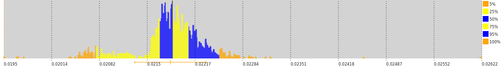

# stats-logscale

A memory-efficient approximate statistical analysis tool
using logarithmic binning.


_Example: repeated setTimeout(0) execution times_

## Description

* data is split into bins (aka buckets),
linear close to zero and logarithmic for large numbers (hence the name),
thus maintaining desired absolute and relative precision;

* can calculate mean, variance, median, moments, percentiles,
cumulative distribution function (i.e. probability that a value is less than x),
and expected values of arbitrary functions over the sample;

* can generate histograms for plotting the data;

* all calculated values are cached. Cache is reset upon adding new data;

* (almost) every function has a "neat" counterpart which rounds the result
to the shortest possible number within the precision bounds.
E.g. `foo.mean() // 1.0100047`, but `foo.neat.mean() // 1.01`;

* is (de)serializable;

* can split out partial data or combine multiple samples into one.

## Usage

Creating the sample container:

```javascript
const { Univariate } = require( 'stats-logscale' );
const stat = new Univariate();
```

**Specifying absolute and relative precision.**
The defaults are 10<sup>-9</sup> and 1.001, respectivele.
Less precision = less memory usage
and faster data querying (but not insertion).
```javascript
const stat = new Univariate({base: 1.01, precision: 0.001});
```

Use _flat_ switch to avoid using logarithmic binning at all:
```javascript
// this assumes the data is just integer numbers
const stat = new Univariate({precision: 1, flat: true});
```

**Adding data points**, wither one by one,
or as _(value, frequency)_ pairs.
Strings are OK (e.g. after parsing user input)
but non-numeric values will cause an exception:
```javascript
stat.add (3.14);
stat.add ("Foo"); // Nope!
stat.add ("3.14 3.15 3.16".split(" "));
stat.addWeighted([[0.5, 1], [1.5, 3], [2.5, 5]]);
```

**Querying data:**
```javascript
stat.count();           // number of data points
stat.mean();            // average
stat.stdev();           // standard deviation
stat.median();          // half of data is lower than this value
stat.percentile(90);    // 90% of data below this point
stat.quantile(0.9);     // ditto
stat.cdf(0.5);          // Cumulative distribution function, which means
                        // the probability that a data point is less than 0.5
stat.moment(power);     // central moment of an integer power
stat.momentAbs(power);  // < |x-<x>| ** power >, power may be fractional
stat.E( x => x\*x );    // expected value of an arbitrary function
```

Each querying primitive has a _"neat"_ counterpart
that rounds its output to the shortest possible
decimal number in the respective bin:

```javascript
stat.neat.mean();
stat.neat.stdev();
stat.neat.median();
```

**Extract partial samples:**

```javascript
stat.clone( { min: 0.5, max: 0.7 } );
stat.clone( { ltrim: 1, rtrim: 1 });
    // cut off outer 1% of data
stat.clone( { ltrim: 1, rtrim: 1, winsorize: true }});
    // ditto but truncate outliers instead of discarding
```

Serialize, deserialize, and combine data from multiple sources

```javascript
const str = JSON.stringify(stat);
// send over the network here
const copy = new Univariate (JSON.parse(str));

main.addWeighted( partialStat.getBins() );
main.addWeighted( JSON.parse(str).bins ); // ditto
```

Create histograms and plot data:

```javascript
stat.histogram({scale: 768, count:1024});
    // this produces 1024 bars of the form
    // [ bar_height, lower_boundary, upper_boundary ]
    // The intervals are consecutive.
    // The bar heights are limited to 768.

stat.histogram({scale: 70, count:20})
    .map( x => stat.shorten(x[1], x[2]) + '\t' + '+'.repeat(x[0]) )
    .join('\n')
    // "Draw" a vertical histogram for text console
    // You'll use PNG in production instead, right? Right?
```

See the [playground](https://dallaylaen.github.io/stats-logscale-js/).

See also [full documentation](https://dallaylaen.github.io/stats-logscale-js/man/Univariate.html).

## Performance

Data inserts are optimized for speed and
querying is cached where possible.
The script [example/speed.js](example/speed.js) 
can be used to benchmark the midule on your system.

Memory usage for a dense sample spanning 6 orders of magnitude
was around 1.6MB in Chromium,
~230KB for the data itself + ~1.2MB for the cache.  

## Bugs

Please report bugs and request features via the 
[github bugtracker](https://github.com/dallaylaen/stats-logscale-js/issues).

## Copyright and license

Copyright (c) 2022-2023 Konstantin Uvarin

This software is free software available under MIT license.
